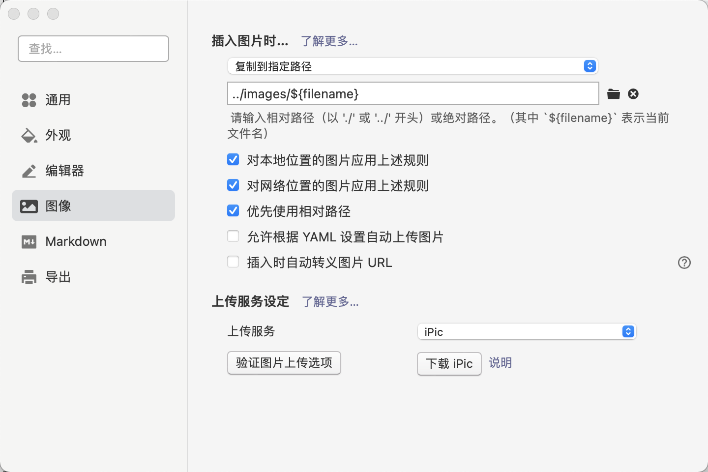

1. 配置环境

​	Mac环境下

```bash
brew install node
npm install -g hexo-cli
```

2. 拉取代码
3. 进入代码根目录，安装模块

```bash
 npm install
 npm install hexo-deployer-git --save
 npm install hexo-generator-feed --save
 npm install hexo-generator-sitemap --save
```

4. 配置typora



5. 创建新文章

```bash
hexo n "title"
```

6. 提交部署

```bash
git add .
git commit -m "some descrption"
git push origin hexo
hexo g -d
```

