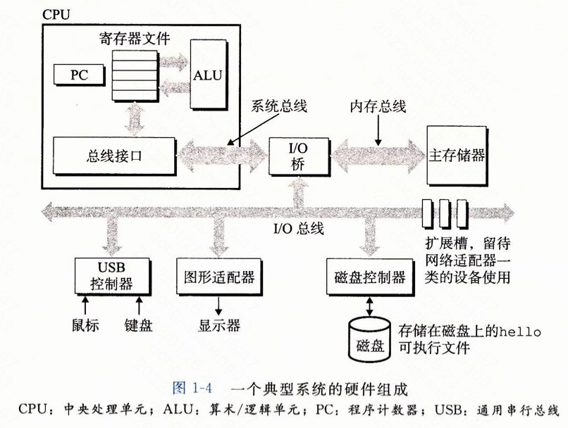
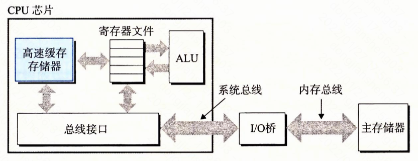
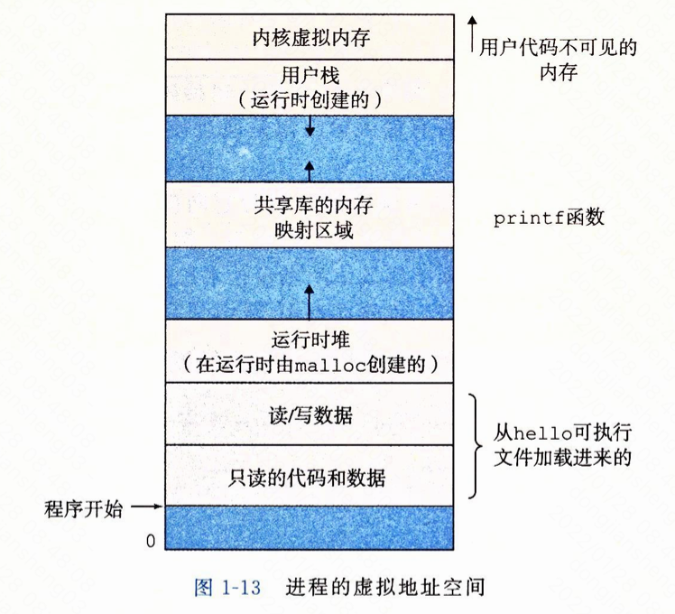
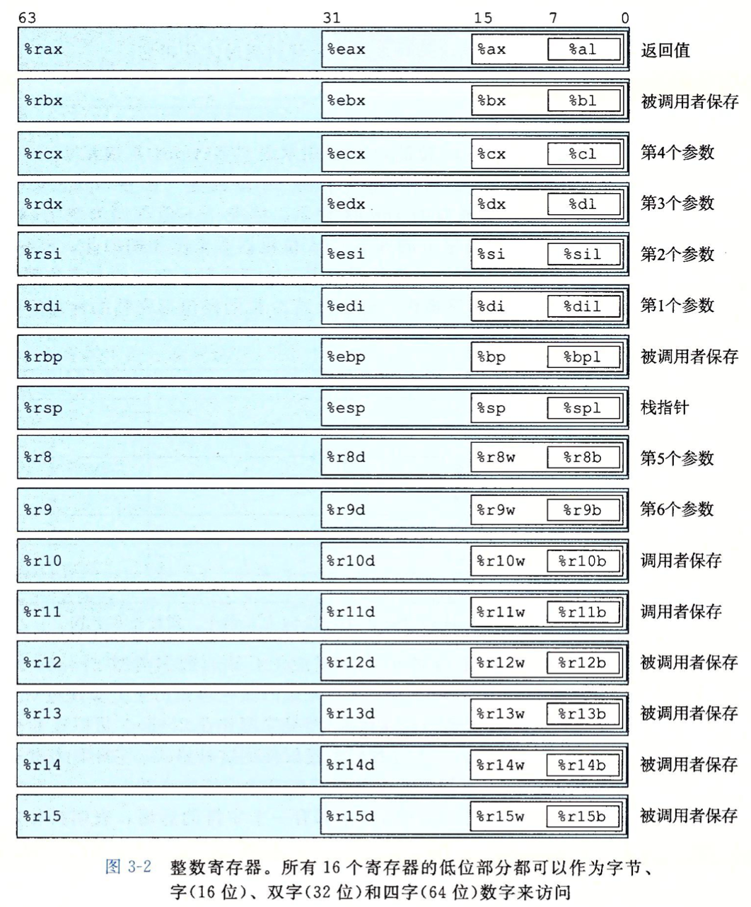

# 概述

#### 系统的硬件组成

- **总线：**贯穿整个系统的一组电子管道，传送定长的字节块，也就是字。32位系统中1字=4字节=32位，64位系统中1字=8字节=64位。
- **I/O设备：**图中有鼠标、键盘、显示器、磁盘。通过控制器或者适配器与**I/O总线**相连。
- **主存：**临时存储设备，在处理执行程序时，存放程序和程序处理的数据。由一组**动态随机存储器（DRAM）**芯片组成。
- **CPU（处理器）：**中央处理单元，是执行存储在主存中指令的引擎。核心是一个大小为**一个字**的**寄存器**（**程序计数器，PC**），PC始终指向主存中的某条机器语言指令，CPU负责执行PC指向的指令，并更新PC。CPU在指令的要求下可能执行的操作包括：
  - **加载：**从主存复制一个字节或一个字到寄存器。
  - **存储：**从寄存器复制一个字节或一个字到主存中。
  - **操作：**将两个寄存器的内容复制到ALU，ALU对这两个字做算术运算并将结果存放到一个寄存器中。
  - **跳转：**从指令本身中抽取一个字复制到PC中。
- **寄存器文件：**由一些单个字长的寄存器组成，每个寄存器都有唯一的名字。
- **ALU（算术/逻辑单元）：**负责计算新的数据和地址值。

#### 运行可执行文件

1. 在shell程序中输入可执行文件名，shell程序会将文件名做为一个指令读入到寄存器，再存放到内存中。
2. 运行可执行文件时，shell首先执行一系列指令来加载可执行文件，会将目标文件中的代码通过**DMA（直接存储器存取）**技术直接从磁盘复制到主存。
3. 处理器开始运行可执行文件，需要将文件中的机器语言指令从主存中复制到寄存器，执行结果再复制到显示设备。

#### 高速缓存的重要性

​	主存和寄存器直接的读写速度相差大约100倍，因此添加高速缓存存储器来存放处理器近期可能需要的信息（**局部性原理**）。典型的高速缓存存储器可能由多级高速缓存组成（L1、L2），这些高速缓存是用**SRAM（静态随机访问存储器）**的硬件技术实现的。

#### 进程

​	进程是对运行的程序的一种抽象，进程切换是由**操作系统内核**管理的，内核是操作系统代码常驻主存的部分。

#### 虚拟内存

- 程序代码和数据：所有进程的代码都是从同一固定地址开始的，代码和数据区就是根据可执行文件内容初始化的。
- 堆：堆区用于代码运行时内存分配，可以通过malloc和free等方法动态分配。
- 共享库：存放类似C标准卡和数学库的区域。
- 栈：栈区用于调用方法时分配，可以在执行程序时动态分配。
- 内核虚拟内存：为内核保留的。

# 程序结构和执行

## 信息的表示和处理

### 字数据大小

​	字长决定了虚拟地址空间的大小，例如对于一个32位机器来说，字长为4字节，虚拟地址的最大为$2^{32}-1$，通常一个地址表示一个字节。

### 整数表示

- 无符号整数：00000000-11111111，范围为0~255。
- 有符号整数：10000000-01111111，**补码**形式，最高位为负权，10000000=$-2^8$=-128，01111111=127。再比如10001111=-10000000+00001111=-128+15=-113。因此，补码表示的正负范围是不对称的。当运算结果溢出时，会对结果进行截断，仅保留类型支持的位数。

### 小数表示

#### 普通浮点表示

​	0.0=0/2=0		0.01=1/4=0.25		0.11=1/2 + 1/4 = 0.75

​	从上面的表示方法可以看出，普通的小数的二进制表示法只能表示那些小数位为2的次幂的小数，而像1/5这样的小数无法准确表示。

#### IEEE浮点表示

https://zhuanlan.zhihu.com/p/358417700

