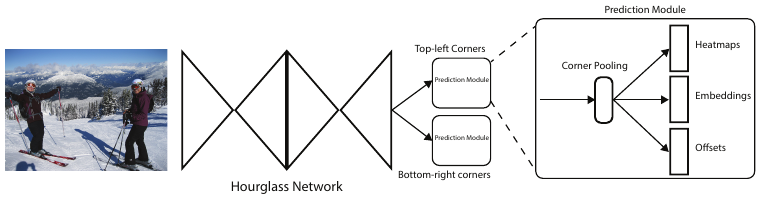
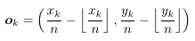
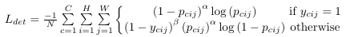
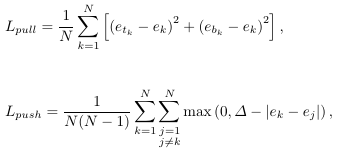
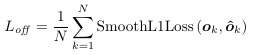
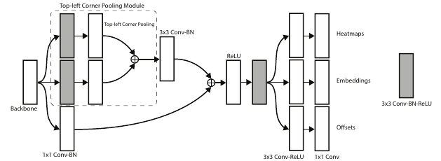

本文总结了面试过程中可能问到的关于CornerNet模型的一些问题。

<!--more-->

# 介绍一下CornerNet的网络结构？

1. 首先采用一个7×7卷积将输入图像尺寸缩小为原来的1/4。

2. 采用两个hourglass模块组成的Hourglass-104作为主干网络提取特征。

3. 每个hourglass模块先通过一系列卷积下采样输入尺寸，然后逐步上采样恢复到输入尺寸大小。

4. 主干网络后面有两个输出分支，分别是左上角关键点预测分支和右下角关键点预测分支。

5. 每个分支通过corner pooling和一系列卷积产生3个输出

   - Heatmaps：输出维度为H×W×C，表示C个类别下H×W个特征点是左上角（右下角）关键点的概率。

   - Embeddings：输出维度为H×W×1，每个特征点的embedding是一个一维标量，用于计算两个关键点之间的距离。

   - Offsets：输出维度为H×W×2，每个点输出两个坐标偏移量：

     

     其中$x_k$，$y_k$表示关键点k的坐标。设在heatmap上点$(x,y)$预测为corner，对应的offset为$\hat o=(\Delta x, \Delta y)$，那么在原图上corner的坐标为

     $$x_0=\lfloor (x+\Delta x)n \rfloor,y_0=\lfloor (y+\Delta y)n\rfloor$$

# CornerNet有什么特点？

CornerNet是一种Anchor-free的目标检测方法，它通过预测物体框的左上角和右下角两个关键点来定位物体。

# CornerNet的损失函数是如何计算的？

CornerNet的损失函数由四部分组成，论文中设置$\alpha=\beta=\gamma=1$：

$$L=L_{det}+\alpha L_{pull}+\beta L_{push}+\gamma L_{off}$$

$L_{det}$为分类损失，采用focal loss。训练时，当坐标(i,j)处是gt点且类别相同，则该坐标为正样本，其他均为负样本。损失函数中设置距离gt越近的负样本会贡献更小的loss：

$L_{pull}$损失是为了将属于同一个目标的两个关键点的embedding拉的更近，$L_{push}$损失是为了将属于不同目标的两个关键点的embedding距离尽可能推开。

$L_{off}$为坐标偏移损失，采用Smooth L1损失：

# 介绍一下corner pooling？

考虑到左上角角点的右边有目标顶端的特征信息，左上角角点的下边有目标左侧的特征信息，因此如果左上角角点经过池化操作后能有这两个信息，那么就有利于该点的预测，这就有了corner pooling。