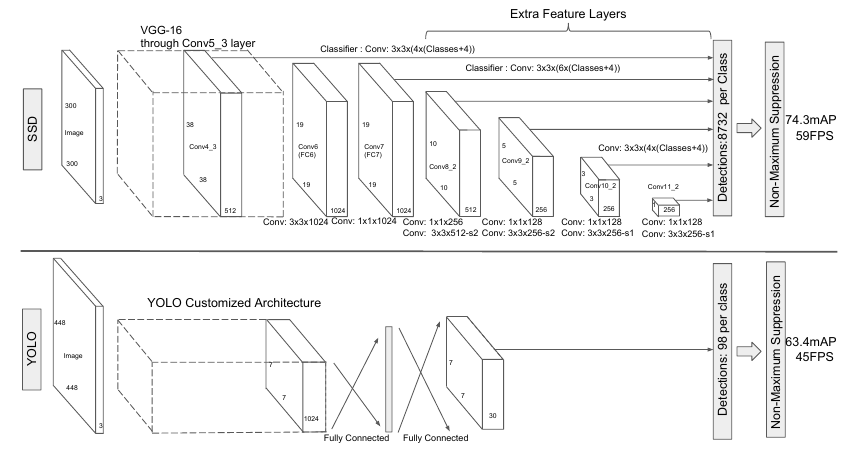
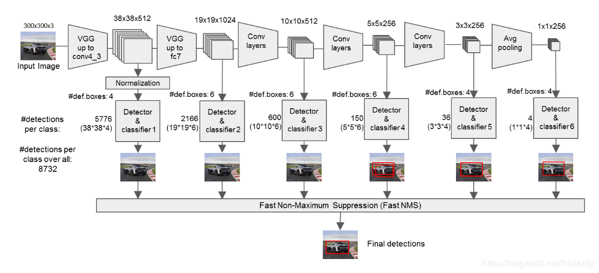
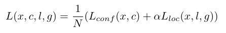

本文总结了面试过程中可能问到的关于SSD模型的一些问题。

[论文地址：Single Shot MultiBox Detector](https://arxiv.org/abs/1512.02325)

<b>图1 SSD与YOLOv1网络结构对比图</b>

<!--more-->

# SSD有哪些主要特点？

1. 类似YOLO，将检测转化为回归，一次性完成定位与回归。

2. 类似Faster RCNN，使用了先验框。

   

   
<b>图2 SSD详细网络结构图</b>

3. 利用了多尺度特征进行检测（300-->38,19,10,5,3,1）。

# SSD网络的输出是什么含义？

SSD包括6个输出，分别是38×38×4×(4+21)，19×19×4×(4+21)，10×10×6×(4+21)，5×5×6×(4+21)，3×3×6×(4+21)，1×1×4×(4+21)，其中(4,4,6,6,6,4)表示该尺度下，每个格子预测的先验框数量，4表示预测的位置信息，21表示20个类别+背景的置信度。

# SSD的先验框是如何设置的？

1. 以特征图每个格子的中心坐标为中心，生成一系列的同心先验框。
2. 设置了m=6个尺度的先验框，最底层特征图上的尺度为$S_{min}=0.2$，最高层的为$S_{max}=0.9$，其余层在0.2到0.9之间均等取值。$S_K$表示先验框与输入图像的比例。
3. 每个尺度设置了4或6种（4,6,6,6,4,4）不同的长宽比$a_r\in{1,2,3,1/2,1/3}$，可以计算第k层的先验框的宽为$w_k^a=s_k\sqrt{a_r}$，高为$h_k^a=s_k/\sqrt{a_r}$，此外还有一个边长为$\sqrt{S_kS_{k+1}}$的正方形框，因此每个格子产生6种框。

# SSD中正负样本如何设定的？

1. 对于每个ground-truth，找到与其IoU最大的先验框设为正样本，这样可以保证每个ground-truth都有一个先验框相匹配。
2. 对于剩余未匹配的先验框，若与某个ground-truth的IoU大于阈值（0.5），则先验框为正样本，其余为负样本。这意味着某个ground-truth可能与多个先验框相匹配（YOLO中，一个ground-truth只有一个对应的先验框）。
3. 训练时，将负样本按背景置信度（预测背景的置信度越小，误差越大）进行排序，选取最低的k个，保证正负样本比例为1:3。

# SSD的是如何训练的？

1. 在ILSVRC上预训练VGG16。

2. 类似于DeepLabv1，将VGG16的前两个全连接层替换为卷积层，并加入了空洞卷积。

3. 采用0.9的Momentum。

4. 采用水平翻转，随机裁剪，颜色扭曲，随机采取区域等数据增强方法。

5. 损失函数由位置误差和分类置信度误差组成：

   

   位置误差采用Smooth L1损失，预测的$(\Delta x, \Delta y,S_w,S_h)$与RCNN系列中的定义一致。分类置信度误差采用softmax损失（交叉熵损失）。

# 测试时是SSD如何进行预测的？

1. 对于每个预测框，首先根据类别置信度确定其类别，并过滤掉置信度小于阈值或属于背景的预测框。
2. 按置信度进行排序，保留top-k个预测框。
3. 根据预测框的位置信息对预测框进行修正。
4. 使用NMS过滤掉重叠较大的预测框。

# 参考资料

https://blog.csdn.net/thisiszdy/article/details/89576389